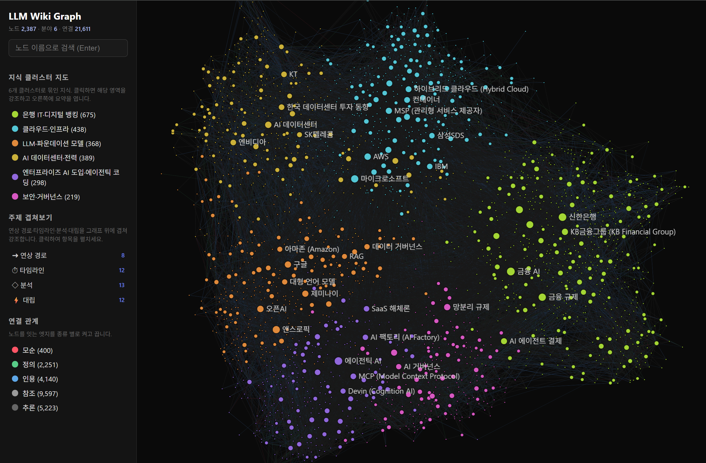
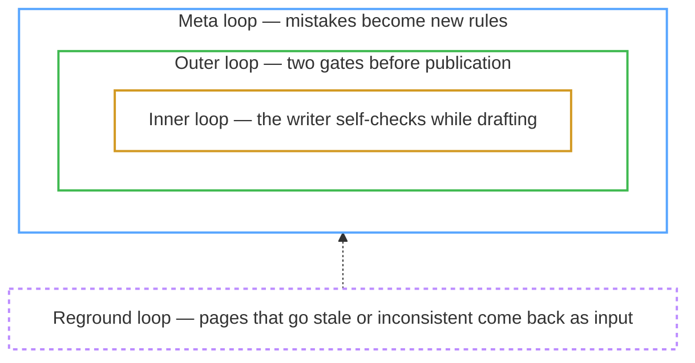

# LLM Wiki Newsroom

[](LICENSE)

**A multi-agent AI knowledge base run by a five-role "newsroom" — open-source, local-first, no API keys, no vendor lock-in.** Drop articles, documents, and PDFs into the `raw/` folder, type a single command, and the newsroom — powered by an agent like Claude Code — reads them, extracts entities, concepts, and relationships, and organizes everything into a fully cross-referenced wiki, a structured and persistent alternative to RAG. Unlike most takes on the idea, the agent that *writes* a page is never the one that *reviews* it, and the authoring guidelines evolve themselves over time. Every new document you add also enriches the existing pages. This repo ships with a small example corpus — the debate over what "open source" means for AI — under `wiki/`, but the framework is domain-agnostic.

> Most knowledge tools leave the *finding* to you. This project **makes the AI read and understand** your collected documents first, then organizes them into a wiki — with cross-references between pages, automatic flagging of conflicting claims, and per-topic synthesis built in from the start, so later retrieval is fast.

> **See the output before installing** — the example corpus shipped in this repo is published as a browsable **[GitHub Wiki](https://github.com/alfadur7/llm-wiki-newsroom/wiki)** (no clone needed). It's a rendered static snapshot of the `wiki/` folder; the interactive graph below runs locally.



<sub>The interactive knowledge graph (`graph/graph.html`) — every page a node, every wikilink an edge, color-coded by auto-detected cluster, with a live physics layout and filter/search built in. Shown here on a larger private deployment (~2,300 nodes) to convey how it scales; **this repo ships a deliberately small 15-node example corpus** you can browse the exact same way. (Interface shown in the optional Korean `WIKI_LANG=ko` mode.)</sub>

## The concept

This project is one question worked into a running system: **how far can you trust knowledge an AI wrote?** Two ideas organize everything below.

**1. The product is an [LLM Wiki](https://gist.github.com/karpathy/442a6bf555914893e9891c11519de94f) — Andrej Karpathy's three-layer pattern.** The original documents you collect (Layer 1, `raw/`), the cross-linked wiki the agent maintains (Layer 2, `wiki/`), and the operating rules the agent follows (Layer 3, `CLAUDE.md` + `.claude/`) are kept strictly separate, so humans and AI don't trespass into each other's territory. As the operator you do exactly two things — feed Layer 1 and tune Layer 3; **only the agent writes Layer 2**. And ingesting one document doesn't just add a page: it refreshes the ~10–15 existing pages that mention the same entities and concepts, which is what makes the wiki compound instead of just piling up.

**2. The factory is a newsroom running four loops.** The wiki is produced by five roles modeled on a newspaper staff — and the agent that *writes* a page is never the one that *reviews* it:

| Role | What it does |
|---|---|
| **Reporter** | gathers material and drafts source pages + entity/concept stubs |
| **Columnist** | writes the deep cross-source analyses |
| **Copy Editor** | rule-based Python checks — not an LLM at all |
| **Desk** | re-reads finished drafts with fresh eyes; the only independent qualitative judgment in the system |
| **Editor-in-Chief** | routes work and gates publication — orchestration, not evaluation |

Four loops turn that division of labor into trust. The first three nest inside one another; only the fourth sits outside, feeding published pages back in:



| Loop | When it runs | What it does |
|---|---|---|
| **Inner** | while drafting | the writer self-checks against the same yardstick the review gates will use later, and hands off instead of grinding |
| **Outer** | at publication | two gates — deterministic lint (Copy Editor), then a six-lens qualitative review (Desk) — and both must pass |
| **Meta** | when mistakes recur | repeat failures become proposals to amend the authoring rules themselves, adopted only after blind measurement plus operator sign-off |
| **Reground** | after publication | published pages that have gone stale or inconsistent come back around as factory input |

The first three loops mirror the "software factory" playbook for AI-assisted coding; the fourth exists because knowledge, unlike code, keeps decaying after you ship it. The full argument for this design is in the companion article: **[The Knowledge Factory](https://alfadur7.github.io/llm-wiki-newsroom/knowledge-factory/)**.

Everything else in this README — the commands, the tools, the feature list — hangs off this map.

## What makes this different

There are plenty of takes on Karpathy's LLM Wiki idea now. After reading the popular implementations, three things here are genuinely rare — and they are the bet:

- **Authoring guidelines that evolve themselves** (the meta loop) — something I haven't found in the other implementations. When the same review failure keeps recurring, the system drafts a fix to its *own writing rules* and keeps it only if a blind A/B against a regression set shows it actually helped — an idea borrowed from [Self-Harness](https://arxiv.org/abs/2606.09498) and [Microsoft SkillOpt](https://github.com/microsoft/SkillOpt). So it isn't only the wiki that improves over time, but the rules that build it. *(This loop is still experimental — I'm measuring whether it earns its keep rather than claiming it's solved.)*
- **A full newsroom, not just "an agent"** (the outer loop) — plenty of tools wrap one agent around your notes, and a few add a verifier. Here authoring and review sit in different hands, the review is held to an editorial rubric drawn from real craft (journalism, consulting, encyclopedic forms) so a different person or session reproduces the same bar, and a two-sided gate means the deterministic lint and the qualitative review must *both* pass.
- **Memex-style associative discovery** — saved reading trails and "unexpected connection" surfacing that the other implementations don't carry.

The rest — the knowledge graph, contradiction tracking, cascading updates, plain-markdown/Obsidian output — many LLM-wiki tools have in some form.

---

## Installation

```bash
git clone https://github.com/alfadur7/llm-wiki-newsroom.git
cd llm-wiki-newsroom
```

> Or click **["Use this template"](https://github.com/alfadur7/llm-wiki-newsroom/generate)** to create your own wiki repo from this scaffold. To start from a clean slate, delete the example pages under `wiki/` (keep the folders and `graph/cluster_labels.json`), then ingest your own sources with `/wiki-ingest`.

This project assumes an environment where the AI agent reads and edits files and invokes tools on its own. Support levels by agent:

| Agent | Config file | Support level |
|----------|----------|----------|
| **Claude Code** (primary) | `CLAUDE.md` + `.claude/commands/` | All 9 slash commands + advanced features (cascading updates, associative discovery, etc.) |
| Codex | `AGENTS.md` | Basic workflow only (drive it with natural language) |
| Gemini CLI | `GEMINI.md` | Basic workflow only (drive it with natural language) |

Claude Code-only features include **cascading updates** that refresh related existing pages whenever a new document is added, a backlink index across all pages, automatic contradiction tracking, and **associative discovery** that follows connected concepts. `AGENTS.md` and `GEMINI.md` carry only the basic workflow from the [original SamurAIGPT project](https://github.com/SamurAIGPT/llm-wiki-agent). The Python tools used to build the wiki run locally with no external API keys.

---

## Slash Commands (Claude Code)

In Claude Code, typing a `/`-prefixed command like `/wiki-ingest` runs the matching workflow. The table below gives each command's role in one line; the [Key Features](#key-features) section explains how they work. Argument notation follows `<required>`, `[optional]`, and `a | b | c` (pick one); invoking a command with no required argument prints usage and stops.

### Core workflow

| Command | Arguments | Description | Example |
|--------|------|------|------|
| `/wiki-ingest` | `<file \| folder \| inbox>` | Absorb one document into the wiki while also refreshing related existing pages. `inbox` processes the mobile share-sheet queue in a batch | `/wiki-ingest raw/NewsScrap/article.md` |
| `/wiki-query` | `<question>` | Find pages related to the question via the graph and answer with supporting evidence | `/wiki-query open source AI definition` |
| `/wiki-lint` | `[--fix]` | Health-check for broken links, missing pages, contradictions, etc. (`--fix` auto-repairs) | `/wiki-lint --fix` |
| `/wiki-graph` | — | Compute the connections between pages and generate an interactive graph | `/wiki-graph` |

### News & sharing

| Command | Arguments | Description | Example |
|--------|------|------|------|
| `/wiki-news` | `[cluster\|keyword]` | Search the web for the latest news related to the wiki's topics and recommend only new articles | `/wiki-news open-source-ai-definition` |
| `/wiki-export` | — | Merge the entire wiki into files for upload to a Claude.ai project | `/wiki-export` |

### Associative discovery

"Associative discovery" is inspired by the [Memex](https://en.wikipedia.org/wiki/Memex) proposed by Vannevar Bush in 1945 — an exploration style that **follows connected concepts to surface unexpected relationships** without a fixed search term.

| Command | Arguments | Description | Example |
|--------|------|------|------|
| `/wiki-discover` | `<seed \| --random \| --surprising \| --gaps [<slug>]>` | Unexpected connections within 2 hops from a seed (or random seed), or auto-ranking of hubs that bridge clusters | `/wiki-discover Meta` |
| `/wiki-trail` | `<create\|follow\|list> [args]` | Build and save a 5–10 step page path that follows a single topic | `/wiki-trail create open source AI definition` |
| `/wiki-timeline` | `<entity> [year]` | A chronological storyline of a person's or company's events sorted by year | `/wiki-timeline Meta 2024` |

You don't have to memorize the slash commands — you can request the same tasks in natural language, and Claude Code figures out the intent and maps it to the right command.

```
"Ingest this file: raw/NewsScrap/article.md"
"What's the relationship between open weights and the OSI definition?"
"Check the wiki for contradictions and auto-fix them"
"Start from Meta and find unexpected connections"
```

---

## Key Features

Grouped by where each feature sits in [the concept](#the-concept) above: first the product (the wiki itself and the ways to explore it), then the loops that make it trustworthy.

### The wiki itself

#### Persistent wiki
AI conversation sessions evaporate when they end, but this project **accumulates the extracted knowledge as structured markdown files**. They're plain text files, version-controlled with Git and viewable in ordinary tools like Obsidian or VS Code, so you're not locked into any vendor.

#### Cascading updates
Ingesting one new document **automatically updates the existing entity/concept pages it mentions**. For example, ingesting an article about "Meta releases an open-weights model" extends the fact list in `Meta.md` and adds an item to the releases section of `OpenWeights.md`. This implements Karpathy's original idea that "ingesting 1 document changes 10–15 pages" — one of the framework's core characteristics.

#### Automatic duplicate-document skip
To avoid re-ingesting the same article, it **double-indexes by URL and file path** (`wiki/sources/_source_map.json`). Even if a re-scrape via Obsidian Web Clipper changes the filename slightly, a matching URL is detected as a duplicate. Cases where a filename drifts due to Unicode quote differences (`'` vs `'`) are normalized and handled too.

#### PDF ingest (multimodal)
Beyond text articles, PDF documents are absorbed through the same pipeline. Drop a `.pdf` file into the `raw/PDF/` folder, and the next `/wiki-ingest` run auto-detects it; Claude Code's Read tool opens the PDF directly and interprets its body, tables, and figures. It's a mechanism for handling **long documents not published as HTML**, like industry reports, regulatory filings, and conference materials.

- **Download**: Put the PDF URL in the inbox queue (`raw/_inbox.md`) and run `/wiki-ingest inbox` to save it as a binary under `raw/PDF/`. Just the `.pdf` lands, with no separate meta file.
- **URL management inside the wiki page**: Record the URL in the `source_url:` frontmatter of `wiki/sources/<slug>.md` generated at ingest, so dedup works even if the same document is re-downloaded. Even if you manually drop just a PDF with no URL, duplicates are filtered by file path.

#### Contradiction detection · 3-layer tracking
When a new document conflicts with existing claims, it's auto-recorded at ingest time. Readers drill down three levels using `wiki/index.md` as the entry point.

1. **`wiki/contradiction.md`** — global aggregation of contradictions. The editor's tension-axis narrative + theme summaries.
2. **`wiki/contradictions/<theme>.md`** — per-theme deep analysis (e.g., whether an "open source" model must release its training data). Which themes exist and which raw issues belong to which theme is defined by `_contradictions_themes.json` as the mapping SoT.
3. **`wiki/contradictions/_contradictions.json`** — source DB of auto-detected individual issues.

It's designed in `macro summary → theme interpretation → raw evidence` order, so wherever a reader stops, that layer reads as self-contained. `wiki/overview.md` covers only per-domain overviews and includes no contradiction references — the common entry point for both axes is `wiki/index.md`.

#### Automatic topic clustering
Instead of a human assigning every entity/concept page to a category by hand, it uses an algorithm that **groups similar topics looking only at the connections between pages** ([Leiden community detection](https://en.wikipedia.org/wiki/Leiden_algorithm)). The result is intuitive clusters — here, the example corpus splits cleanly into "open-source AI definition," "open weights," and "licensing · open-washing." Each source document is assigned by weighted vote to the cluster of the entities it referenced, so documents that overlap in topic are listed in multiple cluster catalogs at once.

> Leiden is the successor to the better-known Louvain algorithm, solving Louvain's limitation (the modularity-local-maxima trap) where cluster boundaries swing wildly under small graph changes, via a refinement stage and connectivity guarantees. In the larger corpus this engine was built for, as the wiki grew to ~470 hubs Louvain hit an unstable regime where adding just 7 new sources would make the cluster count jump from 7 to 10; after adopting Leiden, the same change was measured to stay stable at 8→8. (The small example corpus shipped here has only 3 clusters, so the instability doesn't show up — but the algorithm choice still matters as a wiki grows.)

<details>
<summary>✍️ <strong>Editing cluster labels (<code>graph/cluster_labels.json</code>)</strong> — the one config you hand-edit. <em>Operator detail.</em></summary>

The algorithm only finds clusters; it can't name them. `graph/cluster_labels.json` is a small config file that attaches a **human-understandable name** ("cyber security," "cloud native," etc.) to each automatically found cluster. This file is nearly the only config in this project that the operator opens and edits directly; everything else is auto-generated.

When a new topic cluster is discovered and needs a label, `/wiki-lint` tells you. Just add one entry in the format below.

```json
{
  "slug": "licensing-open-washing",
  "name": "Licensing & Open-Washing",
  "anchor_members": [
    "concepts/ModelLicensing.md",
    "concepts/OpenWashing.md",
    "entities/Meta.md"
  ],
  "paired_with": ["open-source-ai-definition"]
}
```

- **`slug`** — an English identifier. Used as the catalog filename (`_catalog-<slug>.md`) and as the `/wiki-news <slug>` command argument, so use only letters, digits, and hyphens.
- **`name`** — the human-readable display name. Surfaced in the catalog title and the index.
- **`anchor_members`** — 3–6 pages representing this cluster. The script matches a label by "are at least half of the designated representative pages grouped into one community," so too few risks a match failure and too many risks overlap with another community.
- **`paired_with`** *(optional)* — an array of paired-cluster slugs whose work naturally overlaps. E.g., here "licensing · open-washing" ↔ "open-source AI definition" (the two debates share figures and arguments). Writing it on one side applies it both ways, and even if a paired cluster's representative page appears in the per-domain overview body, `/wiki-lint` won't flag it as narrative drift. Do not list a split-off relationship where a domain broke away — there you *do* need to check whether the body is stuck in the old flow.

After editing, re-run `python tools/build.py` and the new name is reflected in every catalog and the index.

</details>

#### Knowledge graph visualization
Drawing every page as a node and every wikilink as an edge, it generates an interactive browser graph (`graph/graph.html`). Clicking a node highlights its connections, and each edge carries a "why it's connected" label readable on mouse hover. Edges are classified into 5 types (contradicts·defines·cites·references·inferred) and color-coded — the 4 explicit edge types stated in the body get different colors by relationship meaning, while inferred edges leading to pages that aren't directly linked but share 3+ common references are shown in lavender, surfacing implicit relatedness.

Serve the `graph/` folder over a local web server (e.g. `python -m http.server`) and open `graph.html` — it fetches its data, so a `file://` double-click is unsupported — and these interactions are available right in the browser:

- **Live physics simulation** — nodes find their place by spring, gravity, and repulsion, and stop automatically when motion settles
- **Drag to rearrange** — drop a node and it pins there; surrounding nodes respond physically to adjust the layout
- **Domain filter** — toggle on/off by clicking in the sidebar; hovering a domain row wraps that region in color
- **Relationship filter** — classify edges into 5 types (contradicts·defines·cites·references·inferred) and toggle, e.g., "I want to see only contradiction relationships in this graph"
- **Search** — search by node name for automatic camera move + top-match highlight
- **Select and explore surroundings** — clicking a node highlights its connected edges and shows neighbor labels; a **local view** mode that keeps only the 1·2·3-hop range to focus on nearby relationships
- **Fragile-bridge highlight** — mark connection points that link two domains by a single edge in orange (sidebar toggle)
- **Analysis overlay** — overlay a saved associative trail or a contradiction's opposing camps in color on top of the graph, to see a path's flow or a confrontation structure within the overall terrain
- **Shareable link** — filter, local-view, and highlight state are all recorded in the URL, so the same view can be shared as-is

#### Two-level index
Once the wiki exceeds 1,000 documents, a single list file becomes hard to navigate. This project lists only entities/concepts/analyses in the main index (`wiki/index.md`) and **splits documents into per-cluster sub-catalogs**. A document spanning multiple clusters is listed in all relevant catalogs. All lists — entities, concepts, analyses — are uniformly sorted A–Z (under `WIKI_LANG=ko`, Hangul-titled pages sort first in ga-na-da order, then A–Z).

### Exploring and sharing the wiki

#### Search/traversal queries (`tools/query.py`)
Having the LLM read every page in full to answer a question is costly, and an AI agent can only handle a limited amount of context at once. This tool is a CLI that helps the agent **understand the structure first, or narrow candidates, before reading pages**, with two subcommands, `graph` and `qmd`.

**Graph traversal** (`python tools/query.py graph ...`) — structural queries using link relationships:

- **`graph path Meta OpenSourceInitiative`** — shows the shortest path connecting two pages and why each link was formed (`[[X]] — connection reason` explanation). You can trace the logical flow from "Meta" to "OpenSourceInitiative" without a single click.
- **`graph explain OpenWeights`** — summarizes which cluster a page belongs to, which pages reference it, and what it points to.
- **`graph neighbors Meta`** — groups directly connected pages by cluster to see "what's around" at a glance.

**Body search** (`python tools/query.py qmd ...`) — local search that actually inspects page bodies to find the ones matching a topic (no external transmission):

- **`qmd hybrid "open weights vs open source"`** — recommendation search combining keyword, meaning, and reranking.
- **`qmd search "OpenAI"`** — BM25 keyword matching (fastest).
- **`qmd vsearch "models that are open in name only"`** — vector-based semantic similarity (finds it by context even when the exact keyword isn't in the body — here, surfacing the open-washing pages).

`--budget N` limits the number of output lines so the agent pulls exactly as much as it can digest. `--json` enables program-to-program integration.

#### Associative discovery — finding unexpected connections
`/wiki-discover` surfaces connections hidden in the wiki in two ways.

- **Seed exploration**: starting from a specific page like `/wiki-discover Meta`, it follows backlinks and co-references 2 hops to present **pages not directly linked to the seed but unexpectedly close** (e.g., "model licensing terms → training-data disclosure"). Giving `--random` picks a random hub in the mid-range of backlink counts and runs the same exploration.

- **Bridge-hub ranking (`--surprising`)**: automatically selects the pages that **most bridge** different topic clusters. The score rises the more often it appears on shortest paths, the more its neighbors span multiple clusters, and the less it's so famous as to seem "obvious." The "unexpected centers" are output as a top N even with no seed input.

#### Associative trails (Memex Trail)
[Vannevar Bush's Memex](https://en.wikipedia.org/wiki/Memex) (1945) proposed knowledge exploration that follows trails between pieces of information. `/wiki-trail` builds and saves a **path of 5–10 pages woven in order, with commentary at each step**, for a given topic. Good for sharing with a team: "to understand this topic, read it in this order."

#### Timeline
Specifying an entity and a year like `/wiki-timeline Meta 2024` generates a **storyline sorted chronologically** of that person's or company's events. It groups by year, combining backlinks and each source's publish date.

#### Wiki-based latest-news search
`/wiki-news` builds keyword combinations from the entities/concepts accumulated in the wiki and **selects only the latest articles** from the web. For example, specifying the `open-source-ai-definition` cluster generates search terms combining that cluster's major hubs ("OpenSourceInitiative," "OSAID," "training data"). It dedups against existing source titles and recommends only new articles as ingest candidates. It fetches the body even on sites with strong bot blocking by behaving like a browser. When a particular topic is empty, it follows the links in related articles to find further candidates to fill that gap.

#### Claude.ai mobile integration
`/wiki-export` exports the wiki in **two layers** — a RAG layer (synthesis pages + directory) that builds the answers, and deep links into the graph browser that serve the detailed originals. A Claude.ai project loads attached knowledge **wholesale into context** rather than retrieving it, so entity/concept bodies (about 70% of the total) and source originals are not put into RAG — doing so would vastly exceed the context limit (~200K tokens). Instead, `index.md` is a directory holding every entity/concept with a one-line description + deep link, and the synthesis layer (domain overviews · contradiction analyses · analysis reports) fills in the substance of answers. `README.md` carries the upload budget guide (start from Core ~130K tokens) and the deep-link convention to paste into project instructions. Push these files to GitHub and connect them as Claude.ai **Project Knowledge**, and you can query the wiki even from a phone — answers built from the synthesis layer, details pointed to via graph links.

So that answers understand the wiki structure and attach links to the graph, paste the entire `wiki-export/README.md` that export also produces (an instruction document covering file structure, answer rules, and the deep-link convention) once into the **custom instructions** box of the Claude.ai project. Then, when citing a hub the answer links to that page, and when pinning a specific claim's source it links straight to the original.

### The inner and outer loops — how a page earns publication

#### Dual automation
The wiki body is not typed by humans. Two kinds of automation handle it in layers.

- **Deterministic automation**: Python scripts generate mechanical outputs like links, rankings, and catalogs
- **Probabilistic automation**: Claude writes narrative prose following authoring guidelines and an evaluation rubric, self-verifying and rewriting against `/wiki-lint`'s automated metrics — the inner loop at work

The human operator's role is tuning the guidelines and rubric and making the final acceptance call — focusing on **directional oversight** rather than sentence-level copyediting. When the guidelines and rubric are fully captured in `CLAUDE.md`, any other Claude session rewrites to the same quality.

#### Separation of authoring and review

The probabilistic automation above doesn't have one Claude do everything. The Claude that writes the body and the Claude that re-reads and reviews it are split into different instances, reducing self-bias. Just as a newspaper divides labor among reporters, columnists, and the desk, authoring and verification are placed in different hands.

- **Two-sided verification gate** — deterministic lint (quantitative metrics like link/citation/structure consistency) and qualitative review with fresh reader's eyes (areas like bias, narrative flow, argument quality) operate as one unit. Passing the quantitative side alone can still be blocked on the qualitative side, and vice versa.
- **Verification failure count** — if the same criterion fails 1st, 2nd, 3rd in a row, the count is tracked automatically, and a 3rd failure for the same reason is escalated to human-operator review to prevent infinite self-repetition.
- **Common 4-stage skeleton** — every workflow (ingest, query, health-check, rewrite, etc.) shares an "observe → write → verify → adapt" 4-stage structure, so new tasks are understood by the same pattern.
- **Two isomorphic verification ladders** — wiki content climbs a Content Verification Ladder (post-edit hook → self-lint → batch lint → qualitative desk review → publish gate), and changes to the writing rules themselves climb a matching Guideline Verification Ladder (deterministic lint → minimal-edit check → blind review → effect-measurement gate). The same "cheapest deterministic check first" principle governs both layers.

#### Editorial-form-based quality evaluation
The body quality of per-domain overviews (`wiki/overviews/<cluster>.md`, `wiki/overview.md`) and per-theme contradiction analyses (`wiki/contradictions/<theme>.md`, `wiki/contradiction.md`) is judged by an **evaluation rubric grounded in external editorial forms**. It's designed to reduce subjective judgment and let different people or different AI sessions reproduce the same standard. The two axes use different forms — a domain overview is writing that spreads information out like a landscape, while a contradiction analysis fairly juxtaposes opposing viewpoints, so the editorial traditions differ.

Forms it draws on:
- **Per-domain overview**: journalism's nut graph · inverted pyramid (NN/g) · PAGE framing; consulting's McKinsey SCR (Situation-Complication-Resolution) · BCG Bold-bullet; Wikipedia's Summary style · Coatrack avoidance
- **Contradiction analysis**: Wikipedia NPOV · ASF (attribute sources) · DUE (due weight); Toulmin argument (claim-grounds-rebuttal-qualifier); Hegelian thesis-antithesis-synthesis; BBC Due Impartiality
- **Common to both axes**: Wikipedia MoS link density · first-mention principle · broken-link avoidance

`python tools/lint.py overview` and `python tools/lint.py contradiction` instantly judge auto-verifiable criteria (total links, density ratio, dedup minimization, section completeness, domain boundaries, etc.) and emit a `✅/⚠️` report. The feedback loop in which Claude self-verifies against this report after writing and rewrites until the required criteria are met serves as the quality bridge of **dual automation**.

#### Health-check · auto-fix
As the wiki grows, problems accumulate: orphan pages (referenced from nowhere), broken wikilinks, missing person pages, naming-convention violations (in the optional Korean mode, say, a Korean company page created under an English filename). `/wiki-lint` checks all of these in one pass and shows a report, and the `--fix` option immediately repairs the auto-fixable items. When topic clusters form differently than expected, the diagnosis is provided alongside. At the end of the report, "page candidates referenced in multiple places but not yet created" are attached as suggestions, hinting at what to create next.

Hard-to-reverse operations like creating a new page or deleting an existing one first show which files are affected and then ask for confirmation — preventing unintended changes even without Git. If the data that synchronization is keyed on (cluster definitions, contradiction theme mapping) is stale, auto-fix pauses briefly and first tells you which command to refresh with.

### The meta loop — rules that learn from their own failures

When the same review failure recurs, the system doesn't stop at fixing individual cases; it **collects those failures and drafts a proposal to fix the authoring guidelines themselves**. So not only the wiki body but the rules that build the wiki learn from their own mistakes.

- Proposals aren't applied immediately — a change must show a **measured effect**: the same task is rewritten side-by-side with and without the change and scored blind, and a pre-fixed regression set confirms nothing else got worse. A substantive change without an accept verdict is held back.
- Guideline edits are reviewed **blind** — a reviewer who never saw the deliberation reads only the diff and classifies each change as substantive or invariant, so wording churn can't masquerade as improvement.
- Every accepted or rejected proposal lands in a **transition ledger**, and defects that recur after a fix are ranked first in the next review round — the loop learns from its own failed fixes, not just from new defects.
- Recurring findings can also be **hardened into code** — promoted into a deterministic lint rule or hook, moving the problem out of the judgment layer entirely so the qualitative review stays pointed at problems nobody has seen before.
- Adoption always ends at the operator gate: the loop proposes and measures; **it never adopts on its own**.

### The reground loop — published pages come back as input

Once code ships it stays put until the spec changes; knowledge doesn't — it drifts away from reality as the world moves. So this system feeds published pages back in as factory input, on three triggers, each an old newsroom practice:

- **Update** — an upstream source changed. `/wiki-lint staleness` surfaces derived pages that lag the sources they were built from; a Columnist re-reads the sources and rewrites. *(A follow-up story.)*
- **Follow-up** — one of the wiki's own claims carries an unresolved marker or a deadline that has now passed. The Desk re-adjudicates, ending at operator confirmation. *(Circling back on a story you promised to follow.)*
- **Correction** — the wiki's own pages disagree with each other or with a generated artifact. The Desk re-reads a published cluster as one bundle, catching the mismatches that reading one page at a time can't reveal. *(A correction notice.)*

These triggers surface work as advisories rather than hard failures (one narrow exception does fail the build), and a deterministic check never closes an item by itself — a human or the Desk does. One honest gap: follow-up items don't yet have a close procedure, so a surfaced item re-fires on every run until an adjudication ledger is built.

---

## Architecture

The three layers from [the concept](#the-concept) live in `raw/` (Layer 1), `wiki/` (Layer 2), and `CLAUDE.md` + `.claude/` (Layer 3). The Layer 2 wiki is further formalized into **four sub-layers**. Knowing which slash command produces or updates each sub-layer makes the workflow intuitive to follow.

| Sub-layer | Role | Producing/updating command | Output location |
|------|------|----------------|---------|
| **L2-1 Source reflection** | Reflect one source into summary, claims, quotes, and connection sections | `/wiki-ingest` | `wiki/sources/<slug>.md` |
| **L2-2 Abstraction** | Extract and update the entities, concepts, and timelines mentioned in sources | `/wiki-ingest`'s cascading update · `/wiki-timeline` | `wiki/entities/`, `wiki/concepts/`, `wiki/timelines/` |
| **L2-3 Per-domain analysis** | Cluster overviews · issue (contradiction) analyses · query answers · discovery trails | Skeletons auto-generated (the full `tools/build.py` rebuild via `/wiki-ingest` · `/wiki-lint overview --fix`; `/wiki-lint contradiction --fix` for issue analyses) → Claude writes the body against an evaluation rubric. Plus: `/wiki-query` · `/wiki-trail` | `wiki/overviews/<cluster>.md`, `wiki/contradictions/<theme>.md`, `wiki/syntheses/<slug>.md`, `wiki/trails/<slug>.md` |
| **L2-4 Global aggregation** | Restate each per-domain overview and per-theme contradiction analysis one paragraph at a time + cross-domain narrative | Claude rewrites periodically | `wiki/overview.md`, `wiki/contradiction.md` |

For example, ingesting one article with `/wiki-ingest` creates L2-1 and L2-2 at the same time. When the next full rebuild recomputes clusters, the relevant per-domain overviews (L2-3) are automatically affected, and Claude rewrites them against the evaluation rubric as needed. The global overview (L2-4) is rewritten periodically once the per-domain overviews stabilize, keeping it current. Each sub-layer is responsible only for its own axis (**per-domain overview** or **issue/contradiction**), so editing one page leaves the other axis's files untouched.

<details>
<summary><strong>Full directory layout</strong> — where every file lives. <em>Skim only if you want the exact on-disk structure.</em></summary>

```
raw/                       # Layer 1: original sources (immutable)
  NewsScrap/               #   HTML article clippings (Obsidian Web Clipper-compatible md)
  PDF/                     #   centrally managed PDF documents (drop *.pdf only)
  AiChat/                  #   topic notes excerpted from AI conversations
  _inbox.md                #   mobile share-sheet URL queue (auto-managed)
  _archive.md              #   accumulated inbox processing results (auto-managed)

wiki/                      # Layer 2: agent-managed wiki
  index.md                 #   full page catalog + drill-down entry point (auto-generated)
  overview.md              #   per-domain overview global aggregation — landscape axis (human + LLM co-managed)
  contradiction.md         #   per-theme contradiction analysis global aggregation — conflict axis (human + LLM co-managed)
  _backlinks.json          #   backlink index (auto-generated)
  sources/                 #   individual source pages + catalog
    _source_map.json       #   ingest deduplication map (auto-generated)
    _catalog.md            #   full source catalog (auto-generated)
    _catalog-<slug>.md     #   per-cluster catalog (auto-generated)
  entities/                #   companies, institutions, people
  concepts/                #   technology, strategy, regulation concepts
  timelines/               #   per-entity chronological timelines
  overviews/               #   per-domain overviews (landscape per cluster)
  contradictions/          #   per-theme contradiction analyses (conflict per theme)
    _contradictions.json        #     contradiction source DB — per claim (auto-generated)
    _contradictions_themes.json #     theme ↔ claim mapping SoT (Claude-generated)
    <theme>.md                  #     per-theme deep analysis (human + LLM co-managed)
  syntheses/               #   saved query answers (Q-A)
  trails/                  #   associative trails (Memex)

wiki-export/               # merged files for Claude.ai Project Knowledge (auto-generated)

graph/                     # knowledge graph + clusters
  _graph.json              #   node/edge data (auto-generated)
  _clusters.json           #   Leiden clusters + source assignment (auto-generated)
  cluster_labels.json      #   ★ stable cluster labels — manually edited config file
  graph.html               #   interactive graph visualization (open in browser)

CLAUDE.md                  # Layer 3: schema (evolved jointly by humans and the LLM)

log.md                     # chronological operations log (append-only)
lint-report.md             # health-check results (auto-generated)
tools/                     # Python tools (no API key required)
```

</details>

<details>
<summary><strong>File naming, placement &amp; page-schema conventions</strong> — reference details. <em>Not needed to get started.</em></summary>

### File naming convention

| Type | Prefix | Examples |
|------|--------|------|
| **Auto-generated data** — scripts overwrite it every run, so do not edit directly | `_` | `_backlinks.json`, `_graph.json`, `_clusters.json`, `_catalog*.md`, `_contradictions.json` |
| **Human-edited** — for manual editing or viewing | none | `index.md`, `overview.md`, `contradiction.md`, `graph.html`, **`graph/cluster_labels.json`** |

Naming rule: an underscore prefix **means** a script output (don't touch it); **no prefix** means a file humans edit or read.

The `wiki/` root meta files (`index`, `overview`, `contradiction`) start directly with `# Title`, **without frontmatter**. Only pages in subdirectories (`sources/`, `entities/`, `concepts/`, `overviews/`, `contradictions/`, etc.) require frontmatter.

### Placement rules

- repo root: operational outputs (log, lint-report)
- `wiki/` root: wiki-wide meta files
- `wiki/sources/`: source-only meta files
- `graph/`: graph data and visualization
- `wiki-export/`: merged files for external distribution
- `tools/`: Python scripts and script-only config

### Language & page schema

The framework's documentation, prose, and **wiki page schema tokens are all in English**. The tools grep for these exact strings, so they are part of the data format rather than display text: section headers such as `## Summary`, `## Connections`, `## Overview`, and `## Timeline`, and inline evidence/relation tags such as `[fact]`, `[analysis]`, and `[forecast]`. Full internationalization of the page schema — making these tokens configurable per language — is a future direction.

</details>

<details>
<summary><strong>Per-slash-command pipeline</strong> — which scripts each command invokes internally and which files it produces. <em>You don't need to expand this on first use; skim it only if you're curious about the internals or want to contribute.</em></summary>

#### `/wiki-ingest <file | folder>`

```
raw/NewsScrap/article.md  or  raw/PDF/report.pdf  (folder argument scans both .md and .pdf)
  1) Dedup: check whether it was already ingested, by both URL and file path
  2) Read the body: markdown as-is; for PDFs the Read tool interprets the binary directly
  3) Write the source page: wiki/sources/<slug>.md with summary, claims, quotes, connection sections
     · For PDFs, the original URL is recorded in this page's source_url field (for dedup)
  4) Cascading update: append new facts to the entity/concept pages that appear in the source and refresh their reference lists
  5) Link enrichment: propose [[wikilink]] candidates for existing page names that appear as plain text in the body
  6) Full rebuild: graph/visualization → clusters/catalogs/per-domain overviews → contradiction source DB → index → dependency index,
     updated in that order (a single tools/build.py run)
  7) Auto-validation: check broken links, filename convention, missing tags
  8) Cluster health diagnosis: surface new topic clusters that need a label (graph/cluster_labels.json)
  9) Append one line to log.md
```

#### `/wiki-query <question>`

```
1) Classify the question by type (entity description / relationship between two pages / topic survey / short-fact / wiki overview / contradiction comparison)
2) Narrow candidates by type (the agent checks the "map" before reading full bodies):
     tools/query.py graph explain <page>   → summarize a page's in/out links, cluster, and connection reasons
     tools/query.py graph neighbors <page>  → group adjacent pages by topic
     tools/query.py graph path <A> <B>      → shortest path between two pages and the reason for each hop
     tools/query.py qmd hybrid "topic"       → body search combining keyword, meaning, and reranking
     tools/query.py qmd search "keyword"     → BM25 keyword matching (fastest)
     tools/query.py qmd vsearch "context sentence" → vector-based semantic similarity
3) Read in full only the ≤10 pages selected above
4) Produce a markdown answer with supporting [[wikilinks]]
5) (Optional) Save the answer to wiki/syntheses/<slug>.md to reuse as material for later queries
```

#### `/wiki-lint [--fix]`

```
Checks are split into the groups below; invoking with no argument runs them all in sequence
(auxiliary groups like synthesis·trail·timeline also run, and staleness is shown for reference only):

  graph  — graph topology and reference consistency
    · structure : broken wikilinks, orphan hubs, missing entity candidates (and, under WIKI_LANG=ko, Korean entities with English filenames)
    · orphans   : bidirectional source↔entity reference match (sources frontmatter ↔ source ## Connections)
    · clusters  : Leiden community health codes [A]–[G] + health-trend log (isolated hubs, unnamed groups, fragile bridges, etc.)
    · internal-refs : whether published content links internal build/guide files (.claude/·tools/·CLAUDE.md) — blocks self-references leaking into RAG
    · raw-files : source page `source_file:` ↔ raw/ filename integrity (smart-quote folding/stripping; --fix repairs unambiguous matches)

  hub    — L2-2 hub page (entity·concept·timeline) status
    · speakers     : people cited ≥3 times across ≥3 distinct sources (speakers/quoted voices)
                     who lack their own entity page — stub candidates
                     (under WIKI_LANG=ko; English corpora use cit.A2 + count_mentions.py)
    · suggestions  : common broken links + frequent body nouns that have no page
                     (informational, no pass/fail impact)
    · schema       : required frontmatter fields for entities/·concepts/·timelines/ files
                     (common title·type·tags·last_updated; entity·concept add sources,
                     entity adds kind) + type matches the folder name

  meta   — meta-document conventions (bundle: integrity + drift + language + flat-path guard)
    · CLAUDE.md anchor link and file path validity
    · craft-skill chain integrity: .claude/layers/_manifest.json ↔ skills criteria.json/checks.py referential closure
    · English section-header convention
    · python tools/lint.py <flat-subcmd> recurrence prevention

  overview       — landscape-axis overview files (L2-3 cluster overview + L2-4 overview.md)
    · Rubric metrics (W1·W2·W3·X2 / L2-4 adds D1·D2·D3·F1) · sections·frontmatter · Freshness
    · narrative drift detection: if another domain's representative page is embedded in the body, advisory notice
      (a case where the domain boundary was realigned but the body kept the old flow). Cross-references
      declared as paired domains are auto-excluded — see the paired_with field in
      graph/cluster_labels.json
    · pass a cluster slug or 'aggregate' as the second argument to check only that file

  contradiction  — conflict-axis per-theme analysis files (wiki/contradictions/<theme>.md)
    · frontmatter · four H2 sections · 1:1 theme↔analysis MD mapping
    · pass a theme slug as the second argument to check only that file

  source         — L2-1 source page authoring convention (wiki/sources/<slug>.md)
    · diagnose source-schema compliance: claim atomization · quote typing · evidence grading, etc.
    · pass a source slug as the second argument to check only that file

Semantic checks (agent): mutually contradicting claims, stale information, empty knowledge gaps
Final result: lint-report.md

--fix behavior by group (only what the group supports actually runs):

| Invocation | What --fix does |
|------|-------------------|
| /wiki-lint --fix (= all) | Run all groups' safe auto-fixes in a batch. EDITOR rewrites and SoT JSON regeneration are **excluded** (require explicit invocation) |
| /wiki-lint graph structure --fix | Auto-add entities mentioned in the body to the source's `## Connections` to reconnect orphan hubs |
| /wiki-lint graph orphans --fix | Auto-backfill source `## Connections` → hub `sources:` frontmatter |
| /wiki-lint graph clusters --fix | Recompute graph data (`_graph.json`·`_clusters.json`) to the current wiki state |
| /wiki-lint hub schema --fix | Auto-fill `type`·`last_updated` in entity·concept·timeline frontmatter |
| /wiki-lint overview --fix | Reconcile cluster ↔ per-domain overview MD (create missing overviews, delete orphan overviews, with a pre-run confirmation prompt) |
| /wiki-lint overview <target> --fix | The above + a Claude EDITOR rewrite instruction block for that domain |
| /wiki-lint contradiction --fix | Reconcile theme ↔ per-theme analysis MD (create missing analyses, delete orphan analyses, with a pre-run confirmation prompt) + insert placeholders for missing H2 |
| /wiki-lint contradiction theme --fix | A Claude instruction block to regenerate the theme ↔ issue mapping SoT (`_contradictions_themes.json`) |
| Other groups/subcommands --fix | Unsupported (warns, then diagnoses only) |

The confirmation prompt can be bypassed with the `--yes` flag — use it in automated environments after pre-review.

New cluster labels are added manually to graph/cluster_labels.json after operator review (no auto-editing).
After --fix completes, tools/build.py runs in full (the empty per-domain overview skeletons get filled at this step).
```

#### `/wiki-graph`

```
tools/build.py graph  (runs the graph stage only)
  · Parse every page and compute two kinds of connections (edges)
    · explicit edges: [[wikilinks]] in the body
    · inferred edges: pairs sharing 3+ common referenced pages
  · Generate graph/_graph.json
  · graph.html itself is a committed static shell — when opened directly in a browser the physics
    simulation runs live to decide node placement. graph.html fetches its data as
    JSON directly (_graph.json·_clusters.json·_pages.json); the reading-panel
    bundle (_pages.json) is generated in the clusters stage

A full wiki rebuild is run automatically by /wiki-ingest · /wiki-lint --fix.
To run it directly: `python tools/build.py` — a 5-stage sequential pipeline:
  graph          → _graph.json
  clusters       → _clusters.json + source catalogs + automatic per-domain overview refresh
                   + graph/_pages.json (the reading-panel bundle graph.html fetches)
                   (Leiden community detection; each document is assigned to the cluster of the hubs
                   it links to, by weighted vote; labels live in graph/cluster_labels.json)
  contradictions → _contradictions.json (source DB collecting contradicting claims from source documents)
  index          → index.md + backlink index + source map
  dependencies   → _dependencies.json (dependency index to judge which documents lag behind updates)
Each stage can also run individually: `python tools/build.py <stage>`.
```

#### `/wiki-news [cluster|keyword]`

```
1) Read the current wiki's topic composition (index.md, cluster meta) to generate search terms
   · With a cluster specified: a query combining 3–5 representative hubs of that topic (English by default; Korean only under WIKI_LANG=ko)
   · No argument: auto-iterate the top 5 clusters by document count
2) Collect the latest articles via web search → dedup against existing source titles
3) Summarize only new articles into a report and present them as ingest candidates
4) (Optional) Add the URLs of articles to ingest to the inbox queue (raw/_inbox.md)
5) `/wiki-ingest inbox` to fetch + absorb (HTML saved under raw/NewsScrap/, PDF under raw/PDF/)
```

#### `/wiki-export`

```
Merge only the wiki's synthesis and directory layers under wiki-export/ (for RAG)
  · Root meta (overview · contradiction · index) copied 1:1
  · Subfolders merged (per-domain overviews · contradiction analyses · timelines · query answers · associative trails)
  · Entity/concept bodies are not generated — the graph holds the full text; index.md is a one-line + deep-link directory
  · Sources carry only a one-line index instead of full text (all-sources-index.md) — originals live in the graph browser
  · README.md — a 2-layer guide + upload budget guide + the deep-link convention to paste into the project instructions box
Push to GitHub to connect as Claude.ai Project Knowledge. Claude.ai loads knowledge in full
(no retrieval), so upload Core (~130K tok) first per the README's budget guide
```

#### `/wiki-discover <seed | --random | --surprising>`

```
Seed exploration (<seed> or --random)
  Choose a starting point:
    · With a seed   → start from that entity/concept
    · --random      → randomly pick a "mid-tier hub" with roughly 5–30 backlinks
                     (neither too famous nor too minor)
  Explore:
    · Read the seed page + the top 5 documents that reference it
    · Find other pages those documents commonly point to
    · Present 3–5 "unexpected connections" not directly linked to the seed

Bridge-hub ranking (--surprising)
  tools/discover.py surprising
    Multiply three criteria to score pages that "bridge topic clusters":
    · shortest-path frequency  : is the connection hard to make without passing through this page
    · neighbor cluster diversity : how many different topics the neighbors span
    · over-degree penalty       : lower the score for pages that are already too famous
  → auto-present the top N "centers of unexpected connection" with no seed input
```

#### `/wiki-trail create|follow|list <topic>`

```
create : explore pages related to the topic, build a 5–10 page "reading order" with
         per-step commentary, and save it to wiki/trails/<slug>.md
follow : read an existing path in order with per-step commentary
list   : list the trails under wiki/trails/
```

#### `/wiki-timeline <entity> [year]`

```
1) Collect all documents referencing the given person/company and sort by publish date
2) Compose a flow summary in three parts:
   · whole trajectory in 1 line (stage1 → stage2 → stage3 ...)
   · per-stage summary (year range · key turning points, 2–3 sentences)
   · current state in 1–2 sentences
3) Append year-grouped event groups and (optionally) save to wiki/timelines/<entity>.md
```

</details>

---

## How it differs from RAG

If you're weighing this against retrieval rather than against other wiki tools: RAG (Retrieval-Augmented Generation) retrieves source chunks per query and injects them into the answer context. This project instead takes the direction of **structuring and accumulating the wiki in advance**.

| | RAG | LLM Wiki Newsroom |
|---|---|---|
| Knowledge state | re-extracted per query | organized once and continuously updated |
| Retrieval unit | source chunk | structured wiki page |
| Cross-reference | none | wikilinks + backlink index |
| Contradiction handling | may surface at query time | flagged at ingest time + DB tracked |
| Accumulation effect | none | new sources enrich existing pages |
| Exploration | keyword search | graph traversal + associative trails (Memex) |

---

## Python tools

The scripts that work behind the slash commands. They **run locally** with no external API keys, and you can call them directly to run just part of the functionality.

| Script | What it does |
|----------|---------|
| `build.py` | Rebuild the entire wiki — a 5-stage sequential pipeline: graph/visualization → clusters/catalogs/per-domain overviews → contradiction source DB extraction → index → dependency index. To run a single stage: `python tools/build.py <stage>` (`graph` / `clusters` / `contradictions` / `index` / `dependencies`) |
| `lint.py` | Group checks: `graph` (page structure · document↔entity references · cluster health) / `hub` (quoted speakers · new-page candidates · L2-2 hub frontmatter) / `meta` (CLAUDE.md internal links · header convention · craft-skill chain integrity) / `overview` (landscape-axis overview file Rubric · Freshness) / `contradiction` (conflict-axis per-theme analysis) / `source` (L2-1 source page schema) / plus auxiliary groups `synthesis`·`trail`·`timeline`·`staleness`. Also suggests "new page candidates worth creating" at the end of the report. `python tools/lint.py graph orphans --fix` auto-connects orphan documents; `python tools/lint.py overview <target> --fix` produces a single per-domain overview skeleton + rewrite instructions |
| `query.py` | Search/traversal CLI — `graph` subcommand for graph traversal (`path A B`·`explain N`·`neighbors N`), `qmd` subcommand for body search (`hybrid`·`search`·`vsearch`). `--budget` to reduce response size and `--json` for machine parsing |
| `discover.py` | Rank pages that bridge clusters (`surprising`) — combine shortest-path frequency · neighbor cluster diversity · over-degree penalty to auto-surface "centers of unexpected connection" |

---

## Current wiki status

A small knowledge base mapping the debate over what "open source" should mean for AI (the example corpus shipped in this repo — kept deliberately small so the whole thing is readable end-to-end):

| Item | Count |
|------|------|
| Source pages | 4 |
| Entity pages | 5 (companies · institutions) |
| Concept pages | 6 (technology · licensing · policy) |
| **Per-domain overviews (Cluster Overview)** | **3** (covering the whole open-source-AI debate) |
| **Per-theme contradiction analyses** | **2** |
| Knowledge graph | 15 nodes, 80 edges (many with relation labels) |
| Backlink index | 11 targets |
| Contradiction tracking | 1 item (classified into 2 themes) |

**Main topics** (3 domain clusters): the open-source AI definition, open weights, and licensing · open-washing — plus 2 contradiction themes cutting across them. (Associative trails and timelines ship empty here; one example synthesis is included — generate more with `/wiki-query`, `/wiki-trail`, and `/wiki-timeline` once you've added sources.)

---

## Entity naming convention

| Type | Filename | Examples |
|------|--------|------|
| Entity (company · institution · person) | English TitleCase | `Meta.md`, `HuggingFace.md`, `Microsoft.md`, `OpenAI.md` |
| English abbreviation is the industry standard | English | `AWS.md`, `CNCF.md`, `MIT.md` |
| Concept | English TitleCase | `AgenticAI.md`, `RAG.md` |
| Non-Latin-script entity (optional, capability retained) | **Native script** | `신한은행.md` (Shinhan Bank — native-script filenames are supported when a name has no standard Latin form) |

---

## Local semantic search (optional)

The `python tools/query.py qmd ...` subcommand and semantic search in Obsidian and Claude Code are powered by a local search engine called [QMD](https://github.com/tobi/qmd). The embedding and reranking models all run on-device; no data leaves to an external service. If you'll only use graph traversal (the `graph` subcommand), you can skip this.

**1) Install QMD + initial indexing**

```bash
npm install -g @tobilu/qmd
qmd collection add "$(pwd)/wiki" --name wiki   # register the wiki folder as one collection
qmd embed                                       # generate embeddings (auto-downloads the GGUF model)
```

The config file is created at `~/.config/qmd/index.yml`. This project configures it to **exclude from search** the root meta files (`overview.md`, `index.md`, `contradiction.md`, etc.) and the auto-generated catalogs (`sources/_catalog*.md`) — focusing only on source/entity/concept pages with real content to reduce noise.

```yaml
collections:
  wiki:
    path: /path/to/llm-wiki-newsroom/wiki
    pattern: "**/*.md"
    ignore:
      - "*.md"
      - "sources/_*.md"
```

**2) Use in Claude Code**

Place a `.mcp.json` at the project root registering QMD as an MCP server, and Claude Code automatically invokes semantic search when you run `/wiki-query`. This file contains local paths, so it's in `.gitignore` and managed per personal environment.

**3) Use in Obsidian**

In Obsidian, open this project's `wiki/` folder as a vault — it must match the collection path above for search results to link to the correct pages.

It's not in the official community store, so install [obsidian-qmd](https://github.com/GoBeromsu/obsidian-qmd) via [BRAT](https://github.com/TfTHacker/obsidian42-brat) (a beta-plugin installer). After installing, apply two customizations for a smoother local-search experience at once with `python tools/patch_obsidian_qmd.py`:

- Display search-result titles using the frontmatter `title:` value instead of the chunk heading (`## Summary`, etc.)
- Configure Hybrid search to automatically skip the heavy LLM stages (reranker, query expansion) — cutting response time from minutes to ten-odd seconds on integrated GPU/CPU setups. When you know the exact term, Keyword mode is fastest at 1–2 seconds (the plugin reloads the model for each search, so going below that requires a separate server that keeps the model resident).

The patch script is idempotent — just re-run it once each time BRAT updates the plugin.

On Windows, after installing Node.js, running the patch script above prepares the Node runtime the plugin needs and also prints the path to put in the plugin settings' **Executable Path** field. Paste the printed path into that field and search will work.

---

## Tips

- Browsing the wiki with [Obsidian](https://obsidian.md) lets you use link-following, graph view, and Dataview queries.
- [Obsidian Web Clipper](https://obsidian.md/clipper) lets you scrape web articles directly into `raw/`.
- While out, collect just URLs via your phone's share sheet, then batch-absorb them on your desktop with a single `/wiki-ingest inbox` (one-time setup: [`.claude/operations/mobile-inbox-setup.md`](.claude/operations/mobile-inbox-setup.md)).
- Running `/wiki-discover` periodically keeps surfacing connections hidden in the wiki.
- Use `/wiki-trail create <topic>` to build a knowledge path for a topic of interest and share it with your team.
- Saving good query answers to `wiki/syntheses/` accumulates them like ingested sources.
- Periodically re-analyzing the contradiction theme summaries (`wiki/contradiction.md` and `wiki/contradictions/<theme>.md`) lets you track how the tension axes of the wiki's whole discourse evolve.
- You can schedule a weekly briefing — summarizing the past week's collected articles by domain cluster — to auto-generate every Monday, recapping a week's flow on a single page.

---

## Design inspiration

- [Andrej Karpathy's LLM Wiki](https://gist.github.com/karpathy/442a6bf555914893e9891c11519de94f) — three-layer architecture, stateful knowledge accumulation, cascading updates
- [Vannevar Bush's Memex (1945)](https://en.wikipedia.org/wiki/Memex) — associative trails, serendipity, augmenting human thought
- [Self-Harness (arXiv:2606.09498)](https://arxiv.org/abs/2606.09498) — self-improvement loop. A 3-stage structure that finds weakness patterns in failure records, fixes the authoring guidelines, and adopts only after passing regression verification
- [Microsoft SkillOpt](https://github.com/microsoft/SkillOpt) (arXiv:2605.23904) — a verification gate that doesn't apply a proposal immediately but accepts it only when the score actually rises on a held-out check task
- [SamurAIGPT/llm-wiki-agent](https://github.com/SamurAIGPT/llm-wiki-agent) — the original project

## License

MIT License — see [LICENSE](LICENSE).
